# Bronze ERD

Five tables, landed from the source CSV batches with no transformation. Every
column is stored as text, and three lineage columns are added so any row can
be traced back to the file and batch it arrived in.

**There are no relationships drawn in this diagram, and that is the finding
rather than an omission.** The source clearly intends `Order_ID` to link
sales, orders and location, and `Agent_ID` to link sales and commission to the
agent master. Those keys do not reconcile: they match on between 0.13% and
1.55% of rows. Drawing the intended relationships here would assert a
structure the data does not have. The measured match rates are carried into
the Silver ERD, where they belong alongside the tables that record them.

```mermaid
erDiagram
    bronze_orders {
        text Order_ID "intended key - repeats on 18 values"
        text Order_Date
        text Shipping_Date
        text Aging
        text Ship_Mode
        text Product_Category
        text Product
        text source_file "lineage"
        text source_row "lineage"
        text batch_timestamp "lineage"
        text ingested_at "lineage"
    }

    bronze_sales {
        text Order_ID "intended FK to orders - 0.13% resolve"
        text Agent_ID "intended FK to agent - 1.55% resolve"
        text Sales "text: 3063 values carry leading zeros"
        text Quantity
        text Discount "integer 0-9, not a fraction"
        text Profit
        text Shipping_Cost
        text Order_Priority
        text Customer_ID "31038 distinct across 31115 rows"
        text source_file "lineage"
        text source_row "lineage"
        text batch_timestamp "lineage"
        text ingested_at "lineage"
    }

    bronze_location {
        text Order_ID "intended FK to orders - 0.17% resolve"
        text Location_ID "not a place key - 330 map to many cities"
        text City
        text State
        text Country
        text Region
        text Segment
        text Customer_Name "only 400 distinct values"
        text source_file "lineage"
        text source_row "lineage"
        text batch_timestamp "lineage"
        text ingested_at "lineage"
    }

    bronze_agent {
        text Agent_ID "intended key - 137 collisions"
        text Agent_Name "only 400 distinct values"
        text Country
        text State
        text City
        text source_file "lineage"
        text source_row "lineage"
        text batch_timestamp "lineage"
        text ingested_at "lineage"
    }

    bronze_agent_commission {
        text Agent_ID "intended FK to agent - 1.47% resolve"
        text Product_Category
        text Commission_Percentage
        text source_file "lineage"
        text source_row "lineage"
        text batch_timestamp "lineage"
        text ingested_at "lineage"
    }
```

## Row counts

| Table | Batch files | Rows |
|---|---|---|
| `bronze_agent` | 2 | 37,252 |
| `bronze_agent_commission` | 2 | 60,991 |
| `bronze_location` | 2 | 25,504 |
| `bronze_orders` | 2 | 27,133 |
| `bronze_sales` | 2 | 31,115 |

Each dataset arrives as two timestamped batch files. Once concatenated,
nothing in the data itself identifies which batch a row came from, so
`source_file`, `source_row` and `batch_timestamp` are extracted from the
filename before the batches are combined. Two findings depend on that:
all 137 agent ID collisions span the two batches, and 88 of the 152
commission conflicts occur inside a single batch — which is what rules out
resolving them by taking the most recent load.
