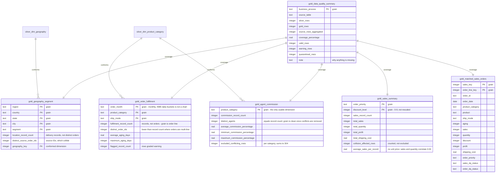

# Gold ERD

Business-ready marts, one per business process. **There is no wide fact table
here, and that is the central design decision.** Order IDs reconcile between
sales and orders on 42 of 31,115 rows, and a three-way join adding location
returns zero. So each process is aggregated from the single Silver table that
holds its data, and only the conformed dimensions cross between them.

What a mart can contain is bounded by what its source table holds. `sales`
carries no date and no product category, so no sales figure is reported over
time or by category. Those absences are recorded in
`gold_data_quality_summary` rather than left unexplained.

## Coverage

| Business process | Source | Silver rows | Aggregated | Coverage |
|---|---|---|---|---|
| `sales_performance` | `silver_sales` | 31,115 | 30,844 | 99.13% |
| `order_fulfilment` | `silver_orders` | 27,133 | 27,133 | 100.00% |
| `geography_segment` | `silver_location` | 25,504 | 25,504 | 100.00% |
| `agent_commission` | `silver_agent_commission` | 60,991 | 60,687 | 99.50% |
| `matched_sales_orders` | `silver_sales` | 31,115 | 42 | **0.13%** |

The first four marts draw on essentially all of their source. The fifth is
the only one that joins two facts, and it is the only one that collapses.
That contrast is the argument for the whole design.

`gold_matched_sales_orders` is a detail table rather than an aggregate. It
exists so the integrity gap is visible: it is the only place revenue and
product category coexist, so it is the only possible source of a category
revenue figure — and it carries 42 rows, 18 of them Electronics against
roughly 7,800 electronics orders in the full dataset. It belongs in the data
quality section of the dashboard, not the business section. The same numbers
are misleading in one place and honest in the other.

## What is deliberately absent

| Missing | Why |
|---|---|
| Revenue over time | `sales` has no date column, and it joins to `orders` on 0.13% of rows |
| Revenue by category | Category lives in `orders`, revenue in `sales` |
| Revenue by region | Geography lives in `location`, which joins to `sales` on 51 of 25,504 rows |
| Profit margin | `sales` and `profit` correlate at −0.001 — the fields are independent |
| Unit price | `sales` and `quantity` correlate at 0.005, and 271 rows have zero quantity |
| Customer-level analysis | 31,038 customer IDs across 31,115 rows; `customer_name` has 400 values drawn from the same pool as agent names |
| Commission by agent geography | Commission resolves to the agent master on 1.47% of rows |

Each absence is a decision, not an oversight, and each is recorded in the
`note` column of `gold_data_quality_summary`.
