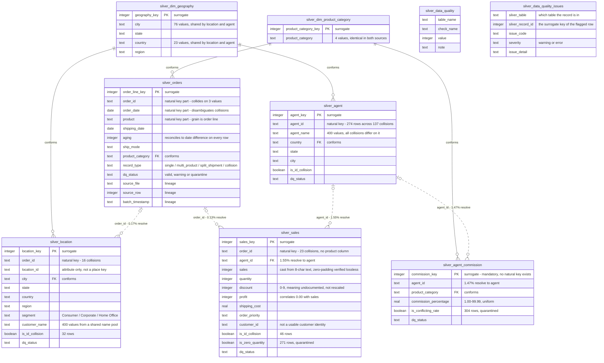

# Silver ERD

Typed, deduplicated-by-label, and validated. Every table carries a surrogate
primary key, because **no natural key in this source is unique**. Collision
rows are retained rather than dropped: there is no basis for deciding which
row of a colliding pair is correct, and dropping either loses a real record.

Two conformed dimensions carry the relationships that actually hold. The
fact-to-fact relationships are shown with their measured match rates, so the
diagram documents the gap rather than implying a join that works.

## Reading the notation

| Notation | Meaning |
|---|---|
| `\|\|--o{` solid | The relationship holds. Both conformed dimensions match exactly across their source tables. |
| `\|o..o{` dashed | The relationship is intended by the source but does not resolve. The match rate is on the label. |

## Keys

| Table | Grain | Natural key | Unique? | Primary key |
|---|---|---|---|---|
| `silver_agent` | one agent | `agent_id` | no — 137 collisions | `agent_key` |
| `silver_agent_commission` | agent × category | `(agent_id, product_category)` | no — 152 conflicts | `commission_key` |
| `silver_orders` | order line | `(order_id, order_date, product)` | no — 2 split shipments | `order_line_key` |
| `silver_sales` | one order | `order_id` | no — 23 collisions | `sales_key` |
| `silver_location` | one order | `order_id` | no — 16 collisions | `location_key` |

Six alternative composite keys were tested and rejected. `(order_id,
shipping_date)`, `(agent_id, city)` and `(order_id, location_id)` are unique
only by accident — they include a mutable measure or a meaningless
identifier. `(order_id, customer_id)` and `(order_id, customer_name)` violate
the functional dependency `order_id → customer_id`, and are unique only
*because* the collisions break that dependency, which would mean using the
defect to conceal the defect.

`silver_data_quality_issues` references the other tables polymorphically —
`silver_table` plus `silver_record_id` — so it is not drawn with relationship
lines. It keys on the surrogate rather than the natural key precisely because
the ambiguity of the natural key is what it exists to record.
